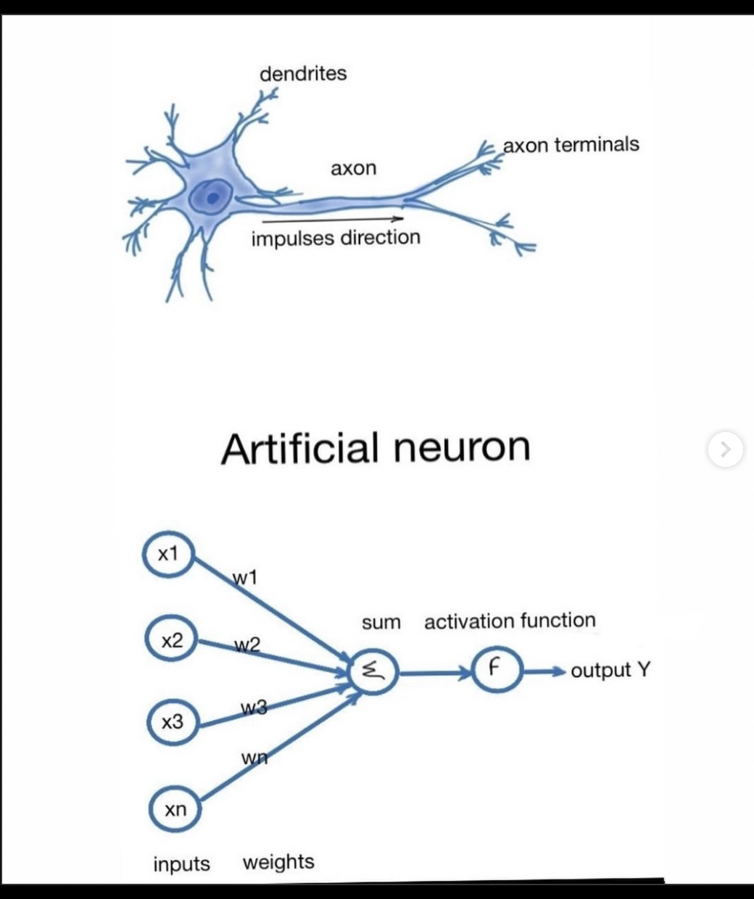

# My Neural Network Project

This repository includes an explanation of neural networks in Spanish and English. The explanation in English is simple, while the Spanish one is more detailed.

## Neuron 

An artificial neuron is a mathematical model inspired by biological neurons. It processes information by receiving multiple inputs, applying weights and biases, and generating an output using an activation function.

Each neuron performs three main operations:

Weighted Sum: Multiplies each input by its corresponding weight and adds a bias.
Activation Function: Applies a function (like Sigmoid or ReLU) to introduce non-linearity, helping the network learn complex patterns.
Output Transmission: Sends the processed result to the next layer of the network.
Neurons are the building blocks of neural networks. When combined in layers, they allow the network to recognize patterns, make decisions, and improve performance through trainin

### Fuction the class Neuronal 

ubicacion de la clase :
Neural_Network/Neuronas/First_Neuron.py

La clase Neuron simula el comportamiento de una neurona real.

### Fuction Inicialización (__init__) Atributos
Atributos :

`Pesos (weight)`: Determinan la importancia de cada entrada.
`Sesgo (bias)`: Permite ajustar la salida de la neurona.
`Salida (output)`: Almacena el resultado después de aplicar la función de activación.
`Entradas (inputs)`: Guarda la entrada recibida.
`Gradientes (dweight, dbias)`: Se usan en el proceso de ajuste de los pesos durante el aprendizaje.

### Fuction Activate(self, x)
    
Esta función aplica la función de activación Sigmoide:

Convierte cualquier valor en un rango entre 0 y 1.
Se usa en redes neuronales para introducir no linealidad y decidir la activación de la neurona.

    
       def activate(self, x):
        """
        Applies the sigmoid activation function.
        
        Parameters:
            x (float): Weighted sum of inputs.
        Returns:
            float: Activated output in the range (0,1).
        """
        return 1 / (1 + np.exp(-x))
    
### Fuction derivate_Activate(self, x)
    
Calcula la derivada de la función Sigmoide, que es útil para la retropropagación.
La derivada de la sigmoide se calcula así:`σ (x)=σ(x)⋅(1−σ(x)) `
    
   
        def derivate_activate(self, x):
        """
        Computes the derivative of the sigmoid function.
        
        Parameters:
            x (float): Activated value.
        Returns:
            float: Derivative of the sigmoid function.
        """
        return x * (1 - x)
    
### Fuction forward(self, inputs)
    
Calcula la salida de la neurona en la fase de propagación hacia adelante (forward pass):

Multiplica las entradas por sus pesos.
Suma el sesgo.
Aplica la función de activación

    
      def forward(self, inputs):
        """
        Computes the forward propagation.
        
        Parameters:
            inputs (np.array): Input values to the neuron.
        Returns:
            float: Output after applying activation function.
        """
        self.inputs = inputs
        weighted_sum = np.dot(inputs, self.weight) + self.bias
        self.output = self.activate(weighted_sum)
        return self.output
   
### Fuction forward(self, inputs)
    
Realiza el ajuste de pesos mediante retropropagación:

Calcula la derivada del error con respecto a la salida.
Ajusta los pesos y el sesgo con descenso de gradiente.

    
        def backward(self, d_output, learning_rate):
        """
        Computes the backward propagation and updates weights and biases.
        
        Parameters:
            d_output (float): Derivative of the loss with respect to the output.
            learning_rate (float): Step size for updating weights.
        Returns:
            np.array: Gradient with respect to the inputs.
        """
        d_activation = d_output * self.derivate_activate(self.output)
        self.dweight = np.dot(self.inputs.T, d_activation)
        self.dbias = np.sum(d_activation)
        d_input = np.dot(d_activation, self.weight.T)

        # Update weights and bias
        self.weight -= learning_rate * self.dweight
        self.bias -= learning_rate * self.dbias
        
        return d_input

    

## Layers 

In a neural network, layers are essential structures that process information as it flows through the model. Each layer contains multiple neurons, which receive inputs, transform them using weights and activation functions, and produce an output that is sent to the next layer.

Neural networks have different types of layers:

Input layer: Receives raw data and sends it into the network.
Hidden layers: Apply transformations to the data using weights, biases, and activation functions. They help detect complex patterns.
Output layer: Produces the final result of the network, adapted for a specific task (classification, regression, etc.).
Layers allow the neural network to learn hierarchical representations of data, making it possible to solve complex problems like image recognition, natural language processing, and more.

https://www.google.com/url?sa=i&url=https%3A%2F%2Fbootcampai.medium.com%2Fredes-neuronales-13349dd1a5bb&psig=AOvVaw3YscJCIMAMGLG7fTegvgsO&ust=1738767347258000&source=images&cd=vfe&opi=89978449&ved=0CBQQjRxqFwoTCLDBtKKjqosDFQAAAAAdAAAAABAJ

##  Fuction the class Layer

ubicacion de la clase :
Neural_Network/Neuronas/First_Layers.py

Initializes a layer with a specified number of neurons.

Supports forward propagation to compute outputs based on inputs.

Implements backward propagation to adjust weights using gradients.

### Fuction Inicialización (__init__) Atributos

Atributos :
`num_neurons (int)`: The maximum number of neurons in this layer.

`num_inputs (int)`: The number of inputs for each neuron in the layer.

`neurons (list)`: A list containing neuron objects in the layer.

## Fuction  forward(self, inputs):

Esta función se encarga de calcular la salida de toda la capa en la fase de propagación hacia adelante. Para ello, cada neurona en la capa recibe las entradas, calcula su salida aplicando pesos, sesgos y una función de activación, y devuelve un conjunto de valores que representan la respuesta de la capa completa.

    def forward(self, inputs):
        """
        Performs forward propagation for all neurons in the layer.

        Parameters:
            inputs (np.array): Input values for the layer.

        Returns:
            np.array: Output values from all neurons in the layer.
        """
        return np.array([neuron.forward(inputs) for neuron in self.neurons])

## Fuction backward(self, d_outputs, learning_rate):
Esta función realiza el proceso de retropropagación en la capa. Calcula los gradientes de cada neurona con respecto a sus pesos y sesgos, lo que permite ajustar estos valores para minimizar el error en futuras predicciones. Además, propaga los gradientes hacia capas anteriores para continuar el ajuste en toda la red neuronal.

     def backward(self, d_outputs, learning_rate):
        """
        Performs backward propagation for all neurons in the layer.

        Parameters:
            d_outputs (np.array): Gradient of the loss with respect to the outputs.
            learning_rate (float): Step size for updating weights.

        Returns:
            np.array: Gradient with respect to the inputs.
        """
        d_inputs = np.zeros_like(self.neurons[0].inputs)
        for i, neuron in enumerate(self.neurons):
            d_inputs += neuron.backward(d_outputs[i], learning_rate)
        return d_inputs